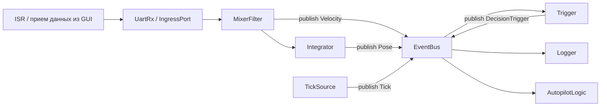
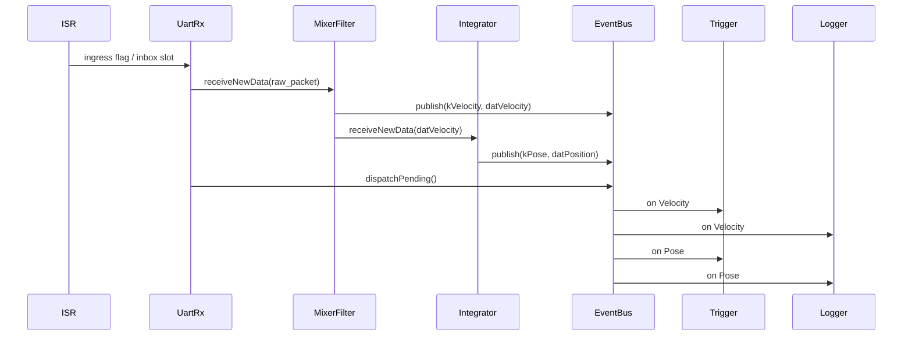
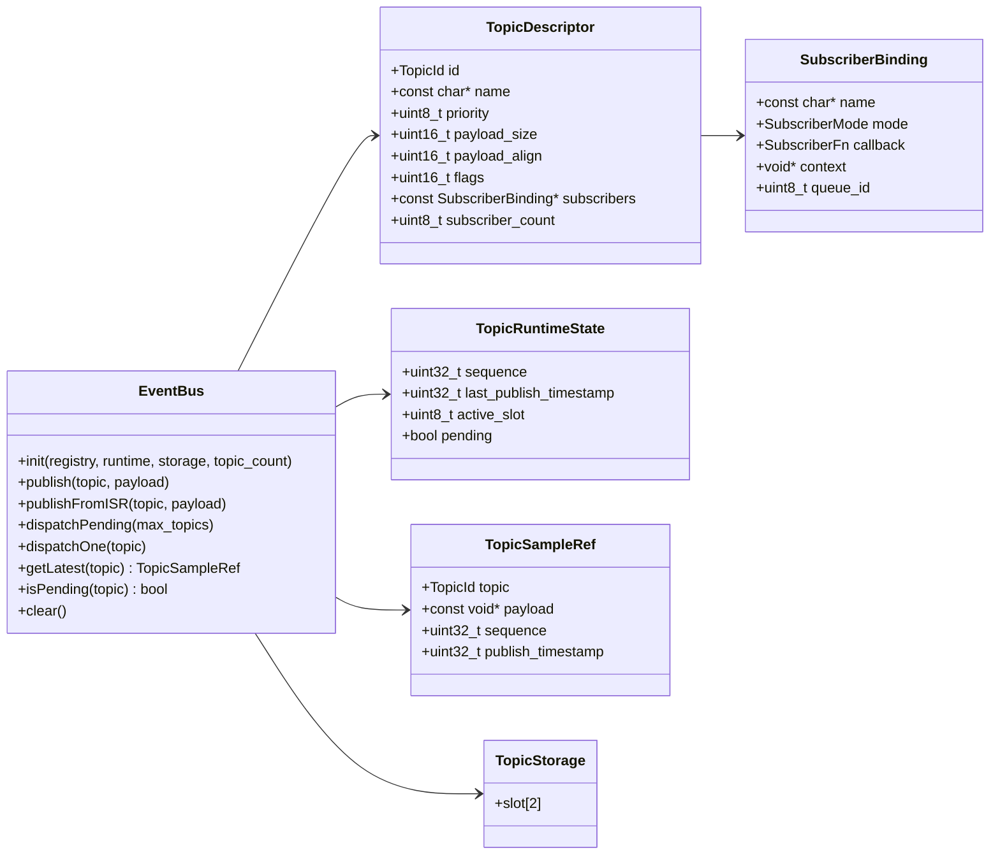

# Архитектура Event Bus и структуры топиков для C++ автопилота

## Что было прочитано перед проектированием

Перед написанием этой спецификации я сверил между собой:

- [Autopilot algorythm.md](/home/necrosii/Programming/Python/Telega_controller/docs/Autopilot%20algorythm.md)
- [ClassDiagram.drawio](/home/necrosii/Programming/Python/Telega_controller/docs/ClassDiagram.drawio)
- [ClassDiagram.drawio.svg](/home/necrosii/Programming/Python/Telega_controller/docs/ClassDiagram.drawio.svg)
- [Autopilot.drawio](/home/necrosii/Programming/Python/Telega_controller/docs/Autopilot.drawio)
- [Autopilot.drawio.svg](/home/necrosii/Programming/Python/Telega_controller/docs/Autopilot.drawio.svg)

Из них для шины событий особенно важны такие исходные идеи:

1. Архитектура должна быть data-driven, а не time-driven.
2. Шина должна быть статической, без динамического добавления топиков и подписчиков во время работы.
3. Для микроконтроллера нужно избегать heap, виртуальных вызовов, `std::function` и прочих толстых абстракций в горячем контуре.
4. Связка `прием -> фильтр -> интегратор` должна быть горячей прямой цепочкой.
5. При этом публикация в топики на промежуточных шагах все равно нужна для логгера, триггеров и диагностики.
6. На первом этапе допускается стратегия `latest wins`, то есть новые данные вытесняют старые.

---

## Область этой спецификации

Этот документ описывает только:

- каркас event bus;
- структуру топиков;
- модель подписчиков;
- базовые payload-типы;
- последовательность обработки;
- оценку overhead.

Этот документ сознательно не проектирует:

- сам алгоритм автопилота;
- физическую модель телеги;
- математику фильтров;
- точный код логгера;
- многопоточную реализацию под RTOS.

---

## Главный вывод по архитектуре

Чистый "pub/sub на всем подряд" для вашей схемы будет избыточным в горячем контуре.  
Чистая "жестко сшитая цепочка прямых вызовов" будет неудобна для расширения, логгирования и добавления новых датчиков.

Поэтому оптимальной здесь является **гибридная схема**:

- горячий путь `UartRx -> MixerFilter -> Integrator` выполняется **прямыми вызовами**;
- результаты каждого шага при этом **зеркально публикуются в топики**;
- все наблюдатели вне горячего пути работают уже через EventBus;
- EventBus остается единым местом для:
  - Trigger;
  - Logger;
  - будущих фоновых обработчиков;
  - RTOS-адаптации;
  - диагностики и трассировки.

Именно это лучше всего соответствует и вашим диаграммам, и вашим пояснениям, и ограничению по overhead.

---

## Что я сознательно изменяю относительно исходной идеи

Ниже перечислены изменения, которые я считаю улучшением после рассмотрения под тремя углами: безопасность lifetime, работа из ISR, и будущий перенос на RTOS.

### 1. Топик не должен хранить голый указатель на чужую память как основной контракт

Изначальная идея:

- publisher кладет указатель на актуальные данные в топик;
- bus только раздает этот указатель подписчикам.

Проблема:

- pointer lifetime очень легко сломать;
- данные могут лежать на стеке;
- ISR может перезаписать буфер в момент, когда dispatcher еще читает старый payload;
- при переносе на RTOS придется заново лечить race condition.

Предлагаемое решение:

- каждый топик владеет **своим double-buffer storage**;
- `publish()` и `publishFromISR()` копируют payload в неактивный слот;
- потом bus атомарно переключает активный слот и помечает топик pending.

Итог:

- никакой dangling pointer;
- один и тот же API работает и в single-thread, и из ISR, и в будущем под RTOS;
- вытесняющая семантика `latest wins` сохраняется;
- копирование небольших структур на первом этапе приемлемо по стоимости.

Это самое важное нововведение в этой спецификации.

### 2. Приоритет должен определяться compile-time порядком registry, а не runtime сортировкой

Исходная идея у вас уже была правильная: порядок топиков должен быть известен заранее.

Я уточняю ее так:

- `TopicId` и порядок в `TopicRegistry` задаются на этапе сборки;
- чем меньше индекс топика, тем выше его dispatch priority;
- bus не делает сортировку во время работы вообще.

Итог:

- никаких лишних сравнений;
- нет runtime аллокации;
- поведение полностью детерминировано;
- overhead зависит только от активных топиков, а не от общего размера системы.

### 3. Dispatcher не должен сканировать весь массив топиков на каждом цикле

Если в bus 32 или 64 топика, а обновился один, полный scan дает лишние условные переходы и ухудшает детерминизм.

Поэтому я предлагаю:

- хранить `pending_mask`;
- вытаскивать следующий топик через `countr_zero / ctz`;
- очищать младший активный бит операцией `mask &= (mask - 1)`.

Итог:

- стоимость dispatch пропорциональна числу реально изменившихся топиков;
- это особенно важно для MCU;
- именно так bus остается "тонким".

### 4. Subscriber должен уметь быть как inline, так и deferred, но API подписки должен быть один

Сейчас все крутится в одном потоке. Позже вы хотите часть узлов унести в RTOS-задачи.

Поэтому подписчик должен иметь режим доставки:

- `Inline`: вызвать обработчик сразу;
- `DeferredQueue`: вместо вызова положить уведомление в очередь задачи.

На первом этапе фактически нужен только `Inline`, но поле в структуре подписчика лучше заложить сразу, чтобы потом не ломать интерфейс bus.

---

## Архитектурный скелет

### Логическая схема



### Что важно в этой схеме

- `ISR` ничего не рассылает подписчикам.
- `ISR` только доставляет вход в безопасный ingress-буфер.
- `UartRx`, `MixerFilter`, `Integrator` образуют прямую тонкую цепочку.
- `EventBus` не заменяет горячую цепочку, а делает ее наблюдаемой и расширяемой.

---

## Базовые группы топиков

### Группа A. Ingress и timing

Это события входа в систему.

### Группа B. Производные состояния

Это результаты фильтрации и интеграции.

### Группа C. Decision/control

Это управляющие события для логики принятия решений.

### Группа D. Планирование и GUI-конфигурация

Это статические или редко меняющиеся данные, приходящие из GUI.

### Группа E. Диагностика и здоровье

Это служебные топики, не влияющие напрямую на hot path.

---

## Рекомендуемый registry топиков

Ниже не "что будет использоваться прямо сейчас", а **полный каркас**, который уже ложится на ваши диаграммы. При этом на первом этапе реально активными будут только первые несколько топиков.

### Минимальный набор для первого этапа

| Priority | TopicId | Payload | Producer | Main subscribers | Нужен сейчас |
| --- | --- | --- | --- | --- | --- |
| 0 | `kVelocity` | `datVelocity` | `MixerFilter` | `Trigger`, `Logger` | Да |
| 1 | `kPose` | `datPosition` | `Integrator` | `Trigger`, `Logger` | Да |
| 2 | `kTick` | `datTick` | `TickSource` | `Trigger` | Да |
| 3 | `kDecisionTrigger` | `datTriggerEvent` | `Trigger` | `AutopilotLogic` | Каркас |
| 4 | `kPwmCommand` | `datPwmCommand` | `AutopilotLogic` | `PwmTx` | Каркас |
| 5 | `kHealth` | `datHealthStatus` | любой модуль | `Logger`, `GuiTx` | Каркас |

### Зарезервированные топики на будущее

| Priority | TopicId | Payload | Producer | Main subscribers |
| --- | --- | --- | --- | --- |
| 6 | `kGuiTrack` | `datTrackModel` | GUI bridge | Planner / nearest-point block |
| 7 | `kGuiSpeedProfile` | `datSpeedProfile` | GUI bridge | Planner |
| 8 | `kGuiLimits` | `datMotionLimits` | GUI bridge | Trigger / Logic |
| 9 | `kImuDelta` | `datImuDelta` | sensor parser | Filter |
| 10 | `kOdometryDelta` | `datOdometryDelta` | sensor parser | Filter |
| 11 | `kNearestTrackPoint` | `datTrackPointRef` | nearest-point block | lookahead block |
| 12 | `kTargetPoint` | `datTargetPoint` | target selector | curvature block |
| 13 | `kCurvatureCommand` | `datCurvatureCommand` | curvature block | kinematics block |
| 14 | `kMotionCommand` | `datMotionCommand` | logic block | differential drive mapper |
| 15 | `kTrackVelocityCommand` | `datTrackVelocityCommand` | kinematics block | PWM mapper |

### Почему `Velocity`, `Pose`, `Tick` идут первыми

Потому что именно они участвуют в вашей базовой decision-loop:

- скорости;
- положение;
- таймер гарантированного принятия решения.

То есть эти топики должны иметь самый высокий приоритет dispatch.

---

## Payload-типы данных

Я стараюсь максимально держаться вашей схемы именования.

## `FPair`

```cpp
struct FPair {
    float A;
    float K;
};
```

### Смысл

- `A` — численное значение;
- `K` — оценка качества / доверия / пригодности по этой координате.

### Почему оставляю `A/K`

Потому что это уже есть на вашей диаграмме.  
Для production-кода я бы предпочел `value/quality`, но на этапе синхронизации архитектуры полезнее сохранить соответствие вашим схемам.

## `datVelocity`

```cpp
struct datVelocity {
    uint32_t timestamp;
    FPair vX;
    FPair vY;
    FPair vZ;
    FPair vPhi;
    FPair vPsi;
    FPair vTheta;

    uint16_t getWeight() const;
};
```

### Для чего нужен

- хранит полный вектор скоростей;
- именно он является основным выходом `MixerFilter`;
- именно он нужен интегратору и trigger.

## `datPosition`

```cpp
struct datPosition {
    uint32_t timestamp;
    FPair X;
    FPair Y;
    FPair Z;
    FPair Phi;
    FPair Psi;
    FPair Theta;

    uint16_t getWeight() const;
};
```

### Для чего нужен

- хранит абсолютную позу;
- это основной выход интегратора;
- это один из ключевых входов trigger и логгера.

## `datTick`

```cpp
struct datTick {
    uint32_t timestamp;
    uint32_t dt_us;

    uint16_t getWeight() const;
};
```

### Для чего нужен

- обеспечивает гарантированное принятие решения даже если часть датчиков зависла;
- играет роль низкоприоритетного "сторожа" decision-loop;
- не должен доминировать над реально свежими данными, поэтому обычно имеет небольшой базовый вес.

## `datTriggerEvent`

```cpp
struct datTriggerEvent {
    uint32_t timestamp;
    uint64_t cause_mask;
    uint16_t total_weight;
    uint16_t threshold;
};
```

### Для чего нужен

- объясняет, почему trigger сработал;
- позволяет логировать не только факт, но и причину запуска алгоритма;
- пригодится для отладки и тюнинга весов.

## `datPwmCommand`

```cpp
struct datPwmCommand {
    uint32_t timestamp;
    int16_t left_pwm;
    int16_t right_pwm;
};
```

### Для чего нужен

- это граница между логикой автопилота и реальным каналом управления;
- на первом этапе этот топик можно оставить "каркасным", не реализуя сам алгоритм.

## `datHealthStatus`

```cpp
struct datHealthStatus {
    uint32_t timestamp;
    uint32_t error_mask;
    uint32_t stale_topics_mask_low;
    uint32_t stale_topics_mask_high;
};
```

### Для чего нужен

- не для hot path;
- а для диагностики зависших топиков, потерь данных, ошибок парсинга, и future GUI-индикации.

---

## Где должны жить веса данных

По вашим пояснениям логика такая:

- сами данные умеют дать "свой" вес;
- trigger домножает его на `baseOfWeights`, который задает алгоритм.

Это хорошая схема. Я рекомендую ее оформить так:

1. Payload имеет метод `getWeight() const`.
2. Отдельная таблица `AlgorithmWeightProfile[TopicId]` задает базовый множитель.
3. Trigger вычисляет:

```text
effective_weight = payload.getWeight() * base_weight[topic]
```

### Почему так лучше

- bus остается нейтральным и ничего не знает о семантике веса;
- payload хранит свою внутреннюю методологию;
- trigger знает только политику принятия решения;
- алгоритмы потом могут иметь разные weight profiles без переписывания bus.

---

## Core API EventBus

Ниже не готовый код, а спецификация интерфейсов.

## `TopicId`

```cpp
enum class TopicId : uint8_t {
    kVelocity = 0,
    kPose = 1,
    kTick = 2,
    kDecisionTrigger = 3,
    kPwmCommand = 4,
    kHealth = 5,
    kGuiTrack = 6,
    kGuiSpeedProfile = 7,
    kGuiLimits = 8,
    // ...
};
```

### Важный контракт

- порядок `TopicId` = порядок приоритета;
- меньший индекс = более высокий приоритет.

---

## `SubscriberMode`

```cpp
enum class SubscriberMode : uint8_t {
    kInline,
    kDeferredQueue
};
```

### Зачем нужен уже сейчас

Чтобы не менять интерфейс подписчика при переходе от single-thread на RTOS.

---

## `TopicFlags`

```cpp
enum TopicFlags : uint16_t {
    kTopicLatestWins      = 1 << 0,
    kTopicAllowISRPublish = 1 << 1,
    kTopicTraceEnabled    = 1 << 2,
    kTopicHotPathMirror   = 1 << 3
};
```

### Смысл

- `kTopicLatestWins` — новые данные вытесняют старые;
- `kTopicAllowISRPublish` — publish из ISR разрешен;
- `kTopicTraceEnabled` — публикации этого топика идут в trace;
- `kTopicHotPathMirror` — топик зеркалит шаг горячей цепочки.

---

## `TopicSampleRef`

```cpp
struct TopicSampleRef {
    TopicId topic;
    const void* payload;
    uint32_t sequence;
    uint32_t publish_timestamp;
};
```

### Зачем нужен

Это объект, который dispatcher передает подписчику.

Он нужен потому, что одного `const void*` мало:

- нужен `sequence` для диагностики и отслеживания потерь;
- нужен `publish_timestamp` для freshness logic;
- нужен `topic`, чтобы один callback мог быть подписан на несколько топиков.

---

## `SubscriberBinding`

```cpp
using SubscriberFn = void (*)(void* ctx, const TopicSampleRef& sample);

struct SubscriberBinding {
    const char* name;
    SubscriberMode mode;
    SubscriberFn callback;
    void* context;
    uint8_t queue_id; // для future RTOS, сейчас 0xFF
};
```

### Что это дает

- никакой виртуальности;
- никакого heap;
- обычный function pointer + opaque context;
- можно сделать compile-time binding helper для type-safe регистрации.

---

## `TopicDescriptor`

```cpp
struct TopicDescriptor {
    TopicId id;
    const char* name;
    uint8_t priority;
    uint16_t payload_size;
    uint16_t payload_align;
    uint16_t flags;
    const SubscriberBinding* subscribers;
    uint8_t subscriber_count;
};
```

### Это конфигурационная часть

`TopicDescriptor` не меняется во время работы.

Он описывает:

- что это за топик;
- сколько он весит по памяти;
- кто на него подписан;
- можно ли публиковать из ISR;
- должен ли он попадать в trace.

---

## `TopicRuntimeState`

```cpp
struct TopicRuntimeState {
    uint32_t sequence;
    uint32_t last_publish_timestamp;
    uint8_t active_slot;
    bool pending;
};
```

### Это runtime часть

Она меняется во время работы и хранится отдельно от descriptor.

Это полезно по трем причинам:

1. descriptor остается в `constexpr`/flash;
2. runtime можно быстро сбрасывать;
3. bus получает чистое разделение "что это за топик" и "что сейчас с ним происходит".

---

## `TopicStorage`

Концептуально для каждого топика нужен double-buffer storage:

```cpp
template <typename Payload>
struct TopicStorage {
    Payload slots[2];
};
```

### Почему именно два слота

- один активный;
- один для записи нового payload;
- после записи происходит переключение `active_slot`.

Это минимальная безопасная схема для `latest wins`.

---

## `PublishResult`

```cpp
struct PublishResult {
    bool accepted;
    bool overwritten_previous;
    uint32_t new_sequence;
};
```

### Зачем нужен

- для тестов;
- для диагностики;
- для будущего trace;
- для понимания, произошло ли вытеснение предыдущей версии.

---

## `DispatchStats`

```cpp
struct DispatchStats {
    uint32_t topics_dispatched;
    uint32_t subscriber_calls;
    uint32_t deferred_enqueues;
};
```

### Зачем нужен

- не для hot path;
- а для отладки и микробенчмарков.

---

## `EventBus`

```cpp
class EventBus {
public:
    void init(
        const TopicDescriptor* registry,
        TopicRuntimeState* runtime,
        void* topic_storage_table,
        uint8_t topic_count
    );

    template <TopicId Id, typename Payload>
    PublishResult publish(const Payload& payload);

    template <TopicId Id, typename Payload>
    PublishResult publishFromISR(const Payload& payload);

    DispatchStats dispatchPending(uint8_t max_topics = 0xFF);
    bool dispatchOne(TopicId id);

    TopicSampleRef getLatest(TopicId id) const;

    template <TopicId Id, typename Payload>
    const Payload* getLatestTyped() const;

    bool isPending(TopicId id) const;
    uint64_t pendingMask() const;
    void clear();
};
```

---

## Семантика методов EventBus

## `init(...)`

### Назначение

- привязать статический registry;
- привязать runtime state;
- привязать storage;
- сбросить pending/sequence/slot.

### Почему bus не создает память сам

Потому что система должна быть статической и MCU-friendly.

---

## `publish(...)`

### Что делает

1. Находит descriptor по `TopicId`.
2. Берет неактивный слот topic storage.
3. Копирует payload в этот слот.
4. Увеличивает `sequence`.
5. Проставляет `last_publish_timestamp`.
6. Переключает `active_slot`.
7. Поднимает бит `pending_mask`.
8. При необходимости пишет trace.

### Что важно

- подписчики здесь не вызываются;
- `publish()` только помечает факт нового payload;
- fan-out делается отдельным dispatch.

Это очень важно для детерминизма.

---

## `publishFromISR(...)`

### Что делает

То же, что `publish()`, но с ограничениями:

- нельзя ходить по подписчикам;
- нельзя лезть в тяжелые очереди;
- нельзя делать сложное логгирование;
- нужно быть lock-free или почти lock-free.

### Рекомендуемый контракт

`publishFromISR()` разрешен только для топиков с `kTopicAllowISRPublish`.

---

## `dispatchPending(...)`

### Что делает

1. Берет локальную копию `pending_mask`.
2. Пока есть активные биты:
   - вытаскивает самый приоритетный активный топик;
   - очищает этот бит;
   - формирует `TopicSampleRef`;
   - вызывает всех подписчиков этого топика.

### Почему это лучше полного scan

- стоимость пропорциональна числу реально обновленных топиков;
- нет прохода по пустым топикам;
- нет лишних веток.

---

## `dispatchOne(id)`

### Что делает

- форсированно раздает один конкретный топик.

### Где полезен

- в тестах;
- в отладке;
- при future RTOS budgeted scheduling.

---

## `getLatest(...)`

### Что делает

- дает ссылку на последнее опубликованное значение топика.

### Кто этим пользуется

- Trigger;
- Logger;
- диагностические инструменты.

---

## Type-safe binding helper

Чтобы не заставлять пользователя руками кастовать `void*`, полезно сразу заложить compile-time helper:

```cpp
template <
    typename Owner,
    typename Payload,
    void (Owner::*Method)(const Payload&)
>
constexpr SubscriberBinding MakeBinding(Owner* instance, const char* name);
```

### Почему это полезно

- ошибка типа ловится на этапе компиляции;
- runtime overhead не растет;
- код регистрации подписчиков становится читаемым.

Это еще одно полезное нововведение, которое хорошо ложится на ваш запрос "максимально чистая архитектура".

---

## Как должен работать hot path

## Принцип

`UartRx`, `MixerFilter`, `Integrator` не общаются между собой через общий dispatch bus.

Они образуют pipeline:

```text
UartRx.processPending()
    -> MixerFilter.receiveNewData(...)
        -> publish(kVelocity)
        -> Integrator.receiveNewData(...)
            -> publish(kPose)
```

После завершения этой цепочки вызывается:

```text
bus.dispatchPending()
```

### Почему именно так

Если пропустить горячую цепочку через полноценный pub/sub, вы получите лишние:

- циклы по подписчикам;
- indirect calls;
- ветки;
- задержку между приемом и обновлением позы.

А это ровно тот контур, который вы хотите оставить максимально тонким.

---

## Как должен работать Trigger

Trigger подписывается минимум на:

- `kVelocity`
- `kPose`
- `kTick`

### Внутреннее состояние Trigger

```cpp
struct TriggerState {
    uint64_t seen_topics_mask;
    uint64_t fresh_topics_mask;
    uint32_t last_decision_timestamp;
    uint16_t accumulated_weight;
    uint16_t threshold;
};
```

### Логика работы

1. При приходе любого подписанного топика trigger читает latest sample.
2. Считает `payload.getWeight()`.
3. Домножает на `base_weight[topic]`.
4. Обновляет свою оценку определенности состояния.
5. Если порог превышен, публикует `kDecisionTrigger`.
6. После публикации обнуляет внутренний таймер decision window.

### Что bus здесь не делает

Bus не считает вес и не знает, что такое "критичные данные".  
Это ответственность Trigger.

---

## Как должен работать Logger

Logger не должен иметь отдельный "магический" интерфейс.

Он просто подписывается на:

- `kVelocity`
- `kPose`
- `kHealth`
- позже, возможно, `kDecisionTrigger`

### Почему это важно

Если логгер просто подписчик, то:

- он не ломает архитектуру;
- его легко отключать;
- его легко уносить в отдельный поток/очередь later;
- hot path не зависит от логгера.

---

## Последовательность обработки на одном семпле



---

## Диаграмма классов EventBus



---

## Как открыть схемы

В этом markdown используются блоки `mermaid`.

Открывать их удобнее всего так:

1. В VS Code открыть этот файл.
2. Нажать `Ctrl+Shift+V` или `Open Preview`.
3. Если нужен отдельный рендер диаграмм, вставить блок `mermaid` в Mermaid Live Editor:
   - https://mermaid.live

GitHub тоже умеет показывать Mermaid-блоки.

---

## Оценка overhead

Ниже я оцениваю не полезную работу фильтра/интегратора, а **чистый архитектурный overhead шины**.

## Принятые допущения

Для оценки беру именно рекомендованную здесь схему:

- hot path прямой;
- в bus публикуются `Velocity` и `Pose`;
- на каждый из этих топиков подписаны `Trigger` и `Logger`.

То есть на один сенсорный семпл:

- 2 `publish()`
- 2 dispatch topic
- 4 subscriber callback invocations

### Для сравнения

Сравнивать будем с прямой callback-схемой, где:

- `Filter` напрямую зовет `Integrator`, `Logger`, `Trigger`;
- `Integrator` напрямую зовет `Logger`, `Trigger`.

---

## Счетчик операций для рекомендованной hybrid-схемы

### На один сенсорный семпл

1. `RX -> Filter` — 1 прямой вызов
2. `Filter -> publish(kVelocity)` — 1 вызов `publish`
3. `Filter -> Integrator` — 1 прямой вызов
4. `Integrator -> publish(kPose)` — 1 вызов `publish`
5. `dispatchPending()`:
   - забрать `kVelocity`
   - вызвать 2 подписчика
   - забрать `kPose`
   - вызвать 2 подписчика

### Итого

- прямых вызовов hot path: **2**
- вызовов `publish`: **2**
- dispatched topics: **2**
- callback вызовов подписчиков: **4**
- loop iterations по подписчикам: **4**
- выходов из subscriber loops: **2**
- операций выбора следующего pending topic: **2**

### Ориентировочное число условных переходов

Если dispatcher реализован через bitmask + `ctz`, получится примерно:

- цикл `while (pending_mask != 0)`: 3 проверки
- цикл подписчиков для `Velocity` (`S=2`): ~3 ветки
- цикл подписчиков для `Pose` (`S=2`): ~3 ветки
- внутренняя readiness-ветка Trigger: 2 проверки

Итого по bus-части:

- примерно **9-11 условных переходов** на один семпл

Это заметно меньше, чем у наивного полного scan всех топиков.

---

## Ориентировочная оценка циклов CPU

### 1. Стоимость `publish()`

Для `latest wins` + double-buffer:

- копирование payload в неактивный слот;
- инкремент sequence;
- запись timestamp;
- flip active slot;
- OR в pending mask.

Для payload порядка 48-64 байт:

- копирование: примерно **12-30 cycles**
- метаданные и pending bit: примерно **8-15 cycles**

Итого:

- `publish()` ~= **20-45 cycles**

### 2. Стоимость dispatch одного топика

Без тела подписчиков, только шина:

- выбрать бит из `pending_mask`: **3-8 cycles**
- получить descriptor/runtime/sample ref: **5-10 cycles**
- loop overhead по подписчикам: **2-4 cycles на итерацию**
- indirect callback dispatch overhead: **6-14 cycles на подписчика**

Для топика с двумя подписчиками:

- `dispatchOne(topic, S=2)` ~= **25-50 cycles**

### 3. Общая стоимость на один семпл

Для `Velocity + Pose`:

- 2 `publish()` = **40-90 cycles**
- 2 `dispatchOne(S=2)` = **50-100 cycles**

Итого чистый bus overhead:

- **90-190 cycles на один семпл**

Это оценка без учета тел `Trigger` и `Logger`.

---

## Сравнение с прямым callback-вариантом

### Прямая схема

На один семпл:

- `RX -> Filter`
- `Filter -> Integrator`
- `Filter -> Logger`
- `Filter -> Trigger`
- `Integrator -> Logger`
- `Integrator -> Trigger`

То есть:

- прямых вызовов: **6**
- subscriber loops: **0**
- bitmask operations: **0**
- topic dispatch: **0**

Чистый overhead прямых вызовов:

- примерно **15-40 cycles**

### Разница

| Схема | Оценка overhead | Комментарий |
| --- | --- | --- |
| Прямые callbacks | ~15-40 cycles | минимальный overhead, плохая расширяемость |
| Рекомендованный hybrid bus | ~90-190 cycles | выше overhead, но хорошая масштабируемость |
| Полный pub/sub на всем пути | ~160-320 cycles и выше | не рекомендую для hot path |

### Время в микросекундах

На MCU 168 MHz:

- 100 cycles ~= 0.60 us
- 200 cycles ~= 1.19 us

То есть разница между hybrid bus и прямыми вызовами обычно лежит где-то в диапазоне:

- **0.4-0.9 us на один семпл**

Это почти всегда приемлемо, если:

- сам фильтр и интегратор не вызываются через pub/sub;
- не делать dynamic polymorphism;
- не сканировать весь registry;
- не копировать гигантские payload-структуры.

---

## Почему full pub/sub для всей цепочки я не рекомендую

Если сделать через bus вообще все:

- raw ingress topic;
- filtered topic;
- integrated topic;
- trigger topic;

то bus начнет участвовать даже там, где вам нужен минимальный latency.

Это даст:

- больше publish вызовов;
- больше subscriber loops;
- больше indirect calls;
- сложнее reasoning по порядку исполнения;
- хуже перенос на реальный hot control loop.

Поэтому **bus должен быть вокруг hot path, а не вместо hot path**.

Это ключевой архитектурный тезис всей этой спецификации.

---

## Минимальный план внедрения

### Этап 1. Каркас bus

Сделать:

- `TopicId`
- `TopicDescriptor`
- `TopicRuntimeState`
- `TopicStorage`
- `SubscriberBinding`
- `EventBus`
- `publish`
- `publishFromISR`
- `dispatchPending`

Без алгоритма автопилота.

### Этап 2. Минимальные payload-типы

Сделать:

- `FPair`
- `datVelocity`
- `datPosition`
- `datTick`
- `datTriggerEvent`
- `datPwmCommand`

### Этап 3. Минимальные stub-модули

Только для проверки связности:

- `UartRxStub`
- `MixerFilterStub`
- `IntegratorStub`
- `TriggerStub`
- `LoggerStub`

### Этап 4. Smoke test

Проверить сценарий:

1. подать входной sensor packet;
2. `FilterStub` генерирует `datVelocity`;
3. `IntegratorStub` генерирует `datPosition`;
4. bus доставляет `Velocity` и `Pose` в `TriggerStub` и `LoggerStub`;
5. trigger по `Tick` или сумме весов публикует `datTriggerEvent`.

Это достаточная тестовая заглушка для проверки архитектуры без реализации автопилота.

---

## Финальная рекомендация

Если кратко, то я рекомендую зафиксировать такой каркас:

1. **Статический compile-time registry топиков**
2. **Статические массивы подписчиков**
3. **Double-buffer storage на каждый топик**
4. **`latest wins` на первом этапе**
5. **`publishFromISR()` только кладет данные и поднимает бит**
6. **`dispatchPending()` только в основном потоке**
7. **Горячий путь `UartRx -> Filter -> Integrator` через прямые вызовы**
8. **Публикация `Velocity` и `Pose` в bus для Trigger/Logger**
9. **Trigger считает веса, bus про веса ничего не знает**
10. **Логгер является обычным подписчиком**

Если потом переносить это на MCU и RTOS, именно этот каркас будет проще всего сохранить без архитектурной ломки.
